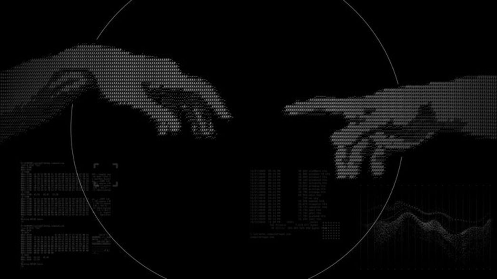

  

<h1 align="center">👋 Olá, eu sou o Pietro!</h1>

  💻 Estudante de Informática • ☕ Java • 🧑‍💻 Futuro Desenvolvedor

  

  

---

## 💻 Sobre mim

Sou estudante do **1º ano do Ensino Médio Técnico em Informática** e estou construindo minha base em programação e desenvolvimento de software.

✝️ Sou **cristão** e busco crescer tanto nos estudos quanto na minha vida pessoal.

Atualmente, estou focado em aprender **Java**, melhorar minha lógica de programação e desenvolver projetos para colocar meus conhecimentos em prática.

---

## ☕ Atualmente estudando

  

* ☕ Java
* 🧠 Lógica de programação
* 🧩 Programação Orientada a Objetos
* 🔧 Git & GitHub
* 💡 Desenvolvimento de projetos

---

## 🤓 Quero aprender

  

* 🗄️ SQL
* 🌱 Spring Boot
* 🔌 APIs REST
* 🐧 Linux
* ☁️ AWS
* 🔐 Segurança de aplicações

---

## 📂 Projetos e estudos

### ☕ Java10X

Repositório com **desafios e projetos desenvolvidos durante meus estudos de Java**.

  

---

## 🎯 Meu objetivo

Construir uma base sólida em **desenvolvimento de software**, aprender através de projetos e registrar minha evolução ao longo dos estudos.

Meu objetivo é transformar conhecimento em **projetos reais**, evoluindo passo a passo como desenvolvedor.

---

## 💭 Citação

> *"Do mais burro ao mais sábio, o amor é imparável."*
>
> — Pietro R.
