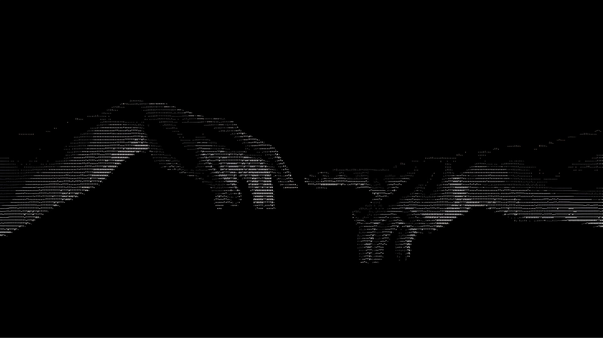

  

<h1 align="center">👋 Olá, eu sou o Pietro!</h1>

  
  

---

## 💻 Sobre mim

Sou estudante do **1º ano do Ensino Médio Técnico em Informática**, atualmente focado em **Java** e construindo minha base em programação e desenvolvimento de software.

---

## 🛠️ Tecnologias e ferramentas

  

---

## 📚 Quero aprender

  

* 🗄️ SQL
* 🌱 Spring Boot
* 🔌 APIs REST
* 🐧 Linux
* ☁️ AWS
* 🔐 Segurança de aplicações

---

## 📂 Projetos e estudos

### ☕ Java10X

Repositório com **desafios e projetos desenvolvidos durante meus estudos de Java**.

  

---

## 🎯 Meu objetivo

Construir uma base sólida em **desenvolvimento de software**, aprender através de projetos e registrar minha evolução ao longo dos estudos.

Meu objetivo é transformar conhecimento em **projetos reais**, evoluindo passo a passo como desenvolvedor.
