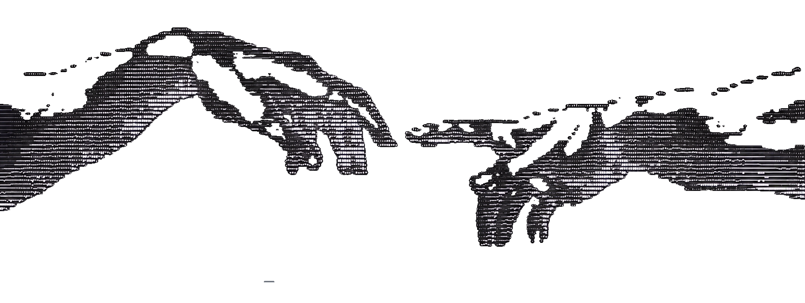

  

<h1 align="center">Pietro Ramos</h1>

  Desenvolvimento de Software • Java

  
  

---

## Sobre mim

Estudante do **Ensino Médio Técnico em Informática**, atualmente focado em **Java** e desenvolvimento de software. 

Busco desenvolver projetos cada vez mais completos, entendendo não apenas o código, mas também a estrutura, organização e decisões envolvidas na construção de um software.

---

## Tecnologias e ferramentas

  

---

## Projetos

### ☕ Java10X

Repositório onde registro minha evolução em Java através de **exercícios, desafios e projetos práticos**.

  

